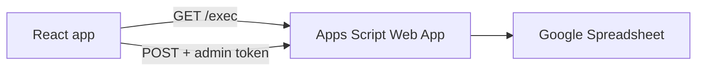

# Roadmap App

Interactive product roadmap viewer built with React and Vite. Initiative data lives in Google Sheets; a bound Apps Script Web App serves reads and authenticated writes to the browser.

## Table of contents

- [About the app](#about-the-app)
- [How it works](#how-it-works)
- [Project setup](#project-setup)
  - [Prerequisites](#prerequisites)
  - [Local development](#local-development)
  - [Other commands](#other-commands)
  - [Deploy to GitHub Pages](#deploy-to-github-pages)
- [Google Sheets setup (step-by-step)](#google-sheets-setup-step-by-step)
  - [Step 1 — Create the spreadsheet and tabs](#step-1--create-the-spreadsheet-and-tabs)
  - [Step 2 — Add headers and data rows](#step-2--add-headers-and-data-rows)
  - [Step 3 — Install Apps Script](#step-3--install-apps-script)
  - [Step 4 — Set the admin token (production)](#step-4--set-the-admin-token-production)
  - [Step 5 — Deploy as Web App](#step-5--deploy-as-web-app)
  - [Step 6 — Connect this repository](#step-6--connect-this-repository)
  - [Step 7 — Smoke test](#step-7--smoke-test)
- [Adding a cohort (step-by-step)](#adding-a-cohort-step-by-step)
  - [Overview](#overview)
  - [Step 1 — Define the cohort in the app](#step-1--define-the-cohort-in-the-app)
  - [Step 2 — Allow the new id in the React app](#step-2--allow-the-new-id-in-the-react-app)
  - [Step 3 — Allow the new id in Apps Script](#step-3--allow-the-new-id-in-apps-script)
  - [Step 4 — Redeploy the Web App](#step-4--redeploy-the-web-app)
  - [Step 5 — Use the cohort in Google Sheets](#step-5--use-the-cohort-in-google-sheets)
  - [Step 6 — Rebuild and verify](#step-6--rebuild-and-verify)
  - [Checklist](#checklist)
  - [Troubleshooting (cohorts)](#troubleshooting-cohorts)
- [Security notes](#security-notes)
- [Troubleshooting](#troubleshooting)
- [Project structure](#project-structure)

## About the app

The roadmap displays initiatives on a quarterly timeline grid. Each initiative appears as a bar spanning its start and end dates. Users can:

- Filter by team, initiative, and cohort
- Switch light / dark / system theme
- Hover initiatives for name and description
- Add new initiatives via an admin modal (when the Sheets API is configured)

The page title and cohort filter labels are defined in the app (`src/config/roadmapDefaults.js`), not in the spreadsheet. Team tabs and initiative rows come entirely from Google Sheets.

**Stack:** React 19, Vite 8, Google Apps Script (backend), GitHub Pages (optional deployment).

## How it works



1. **Read path** — On load, the app calls `VITE_SHEETS_API_URL` (your deployed Web App URL). Apps Script scans every sheet in the bound spreadsheet. Any tab whose row 1 matches the roadmap headers is included; the tab name becomes the team key (lowercased, e.g. `Relias` → `relias`).
2. **Display** — `useRoadmapData` merges the JSON with defaults, computes quarters from date ranges, and renders filters plus `RoadmapGrid` bars.
3. **Write path** — With a valid admin token (modal or `?token=YOUR_TOKEN` in the URL), you can **add**, **edit**, and **delete** initiatives entirely from the UI. Add uses `AdminModal`; **Edit** opens the same modal pre-filled from the initiative tooltip (Domain and ID are locked since they identify the row); **Delete** is also on the tooltip. POST requests include `adminToken` and an `action` (`add` / `update` / `delete` / `updateStatus`); Apps Script validates the token, then appends, updates, or deletes a row on the matching team tab by ID.
4. **Build** — `VITE_SHEETS_API_URL` is injected at compile time. Local dev uses `.env`; GitHub Actions uses the `VITE_SHEETS_API_URL` repository secret.

There is no local `data.json`; the Sheets Web App is required for the app to load data.

## Project setup

### Prerequisites

- Node.js 18+ (22 recommended for CI)
- npm
- A Google account with access to create spreadsheets and deploy Apps Script Web Apps

### Local development

1. Clone the repository and install dependencies:

   ```bash
   cd roadmap-app-2
   npm install
   ```

2. Copy the environment template and set your Web App URL:

   ```bash
   cp .env.example .env
   ```

   Edit `.env`:

   ```env
   VITE_SHEETS_API_URL=https://script.google.com/macros/s/YOUR_DEPLOYMENT_ID/exec
   ```

   Use the URL from **Deploy → Web app** in Apps Script (must end with `/exec`). Complete the [Google Sheets setup](#google-sheets-setup-step-by-step) first.

3. Start the dev server:

   ```bash
   npm run dev
   ```

4. Open the URL Vite prints (usually `http://localhost:5173`).

### Other commands

| Command           | Description              |
|-------------------|--------------------------|
| `npm run build`   | Production build to `dist/` |
| `npm run preview` | Preview production build |
| `npm run lint`    | Run ESLint               |

### Deploy to GitHub Pages

1. In the GitHub repo: **Settings → Secrets and variables → Actions**.
2. Add repository secret **`VITE_SHEETS_API_URL`** with the same Web App `/exec` URL as local `.env`.
3. Push to `main` or run the **Deploy to GitHub Pages** workflow manually.

The workflow in `.github/workflows/deploy.yml` builds with that secret and publishes `dist/`. The app base path is `/roadmap-app-2/` (see `vite.config.js`).

---

## Google Sheets setup (step-by-step)

Complete these steps once per spreadsheet. The script must be **bound** to the spreadsheet (opened via **Extensions → Apps Script** from that file).

### Step 1 — Create the spreadsheet and tabs

1. Create a new Google Spreadsheet (or use an existing one).
2. Add an **App Config** tab (first tab recommended) with these headers in row 1:

   | A         | B       | C (optional) |
   |-----------|---------|--------------|
   | Team Name | Team Id | Color        |

   Example rows: `Team 1` / `t1`, `Team 2` / `t2`. These drive the **Team:** filter pills and the add-initiative checkboxes. You can also add or remove teams from the app via **Manage teams** (admin token required).

3. Add one tab per **domain** (roadmap row). Example tab names and how they appear in the app:

   | Tab name (sheet) | Team key in app |
   |------------------|-----------------|
   | Relias           | `relias`        |
   | Nurse            | `nurse`         |
   | Platform         | `platform`      |
   | Compliance       | `compliance`    |
   | Shared           | `shared`        |

   Tab names are case-insensitive in the API (`Relias` and `relias` both map to key `relias`). You can add more teams by adding tabs with the correct headers (see step 2).

### Step 2 — Add headers and data rows

On **each** team tab, set **row 1** to these headers (exact names recommended):

| A   | B    | C             | D               | E             | F      | G     | H     | I        | J    |
|-----|------|---------------|-----------------|---------------|--------|-------|-------|----------|------|
| ID  | Name | Description   | Timeline Start  | Timeline End  | Status | Teams | Owner | Priority | Link |

- **Data rows** start at row 2.
- **ID** — unique per tab (e.g. `PLAT-101`).
- **Timeline Start / End** — `YYYY-MM-DD` (e.g. `2026-04-01`). Date cells are formatted by the script.
- **Status** — optional; one of the status dropdown values (`In Progress`, `Close to done`, `At Risk`, `Done`, `Future`, `Paused`). Drives the bar color. (A `Color` header with a hex value is still accepted here for backwards compatibility.)
- **Teams** — optional team ids from App Config (comma-separated, e.g. `t1,t2`).
- **Owner** — optional free-text name of the person/team responsible (e.g. `Jane D.`).
- **Priority** — optional; one of `High`, `Medium`, `Low`. Shown as a color-coded badge and available as a filter.
- **Link** — optional URL (must start with `http://` or `https://`); rendered as a clickable link in the initiative tooltip.

Headers are matched by name, not position — extra columns can be reordered, but keeping **Teams** in column G is recommended (the team-usage check reads that column directly). Owner/Priority/Link are optional; existing rows left blank simply show nothing for those fields.

Tabs without this header row are ignored. Empty ID cells are skipped.

### Step 3 — Install Apps Script

1. Open the spreadsheet.
2. Go to **Extensions → Apps Script**.
3. Remove any default code.
4. Paste the full contents of [`scripts/google-apps-script/Code.gs`](scripts/google-apps-script/Code.gs).
5. **Save** the project (Ctrl/Cmd+S).

**Adding a new team later:** Create a new sheet with the same row-1 headers, save the script project, then **redeploy** the Web App (step 5) so the latest code runs.

### Step 4 — Set the admin token (production)

For development, the script ships with a default token `roadmap-dev-2026` (see `DEFAULT_ADMIN_TOKEN` in `Code.gs`). Use that in the **Add initiative** popup until you configure production.

For production:

1. In Apps Script: **Project settings** (gear) → **Script properties**.
2. Add property **`ADMIN_TOKEN`** with a strong secret value.
3. Save. This overrides the default token.

Share the token only with people allowed to add initiatives. It is kept in browser `sessionStorage` for the current visit only; refresh locks the form again. Use **Lock** in the admin modal to clear the token without refreshing.

Do **not** put the admin token in `.env` or any `VITE_*` variable.

### Step 5 — Deploy as Web App

1. **Deploy → New deployment**.
2. Type: **Web app**.
3. **Execute as:** Me (your Google account).
4. **Who has access:** **Anyone** (required so the public site and GitHub Pages can call the API).
5. Click **Deploy** and copy the **Web App URL** (ends with `/exec`).

**Quick test:** Open the URL in a browser. You should see JSON with team keys and initiative arrays, for example:

```json
{ "relias": [ ... ], "nurse": [ ... ] }
```

Optional: `YOUR_URL?action=tabs` returns `{"tabs":["relias","nurse",...]}`.

After script changes, use **Deploy → Manage deployments → Edit → New version** and redeploy; otherwise an old deployment may still run.

### Step 6 — Connect this repository

1. Set `VITE_SHEETS_API_URL` in `.env` (local) to the Web App URL from step 5.
2. For GitHub Pages, set the same value as the **`VITE_SHEETS_API_URL`** Actions secret.
3. Run `npm run dev` and confirm the roadmap loads.

### Step 7 — Smoke test

| Step | Expected result |
|------|-----------------|
| Open the site | Roadmap loads with bars from your sheet tabs |
| Click **Add initiative** | Modal opens |
| Enter admin token | Form fields unlock for this session |
| Submit a test row | Success message; row appears in the sheet |
| Refresh the page | New initiative appears on the grid |

---

## Adding a cohort (step-by-step)

Cohorts are split across the app (filter labels and colors) and the spreadsheet (which initiative belongs to which cohort). The cohort **id** (e.g. `c5`) must match in every place below.

This example adds **Cohort 5** with id `c5`. Repeat the same pattern for `c6`, `c7`, and so on.

### Overview

| What | Where |
|------|--------|
| Filter pill label and dot color | `src/config/roadmapDefaults.js` → `ROADMAP_DEFAULTS.cohorts` |
| **Add initiative** dropdown | Same file → `COHORT_OPTIONS` |
| Admin form validation (browser) | `src/services/sheetsApi.js` |
| Save validation (Google) | `scripts/google-apps-script/Code.gs` → `VALID_COHORTS` |
| Initiative assignment | Sheet column **G** on each team tab |

### Step 1 — Define the cohort in the app

Edit [`src/config/roadmapDefaults.js`](src/config/roadmapDefaults.js).

1. Add an object to the `cohorts` array (controls the filter row on the roadmap):

   ```js
   { id: "c5", label: "Cohort 5", color: "#ec4899" },
   ```

   - **`id`** — short key stored in the sheet and used for filtering (lowercase, no spaces, e.g. `c5`).
   - **`label`** — text shown on the filter pill.
   - **`color`** — hex color for the pill dot (e.g. `#ec4899`).

2. Add a matching entry to `COHORT_OPTIONS` (controls the admin modal dropdown):

   ```js
   { value: "c5", label: "Cohort 5 (c5)" },
   ```

   Keep `{ value: "", label: "None" }` as the first option.

### Step 2 — Allow the new id in the React app

Edit [`src/services/sheetsApi.js`](src/services/sheetsApi.js).

In `validateInitiativeForm`, extend the allowed cohort list (around line 90):

```js
if (cohort && !["c1", "c2", "c3", "c4", "c5"].includes(cohort)) {
  errors.cohort = "Cohort must be c1, c2, c3, c4, or c5.";
}
```

Without this change, the **Add initiative** form rejects the new cohort even if it appears in the dropdown.

### Step 3 — Allow the new id in Apps Script

1. Open your spreadsheet → **Extensions → Apps Script**.
2. Edit [`scripts/google-apps-script/Code.gs`](scripts/google-apps-script/Code.gs) in the bound project (or paste the updated file from the repo).
3. Add the new id to `VALID_COHORTS`:

   ```js
   var VALID_COHORTS = ['c1', 'c2', 'c3', 'c4', 'c5'];
   ```

4. Update the error message in `appendInitiative_` if it still lists only `c1`–`c4`.
5. **Save** the script project.

### Step 4 — Redeploy the Web App

1. **Deploy → Manage deployments**.
2. Edit your Web App deployment → **New version** → **Deploy**.

If you skip redeploy, POST requests with `c5` may still fail with “Cohort must be c1, c2, c3, or c4” from the old script.

### Step 5 — Use the cohort in Google Sheets

On any team tab, set column **G (Cohort)** to the new id for initiatives that belong to that cohort:

```
c5
```

- Use the **exact** id from step 1 (`c5`, not `C5` or `Cohort 5`).
- Leave the cell empty for initiatives with no cohort.
- You can edit existing rows or pick the cohort when adding via **Add initiative** (after steps 1–4).

### Step 6 — Rebuild and verify

1. **Local:** `npm run dev` — confirm a new **Cohort 5** pill appears and filtering works.
2. **Production:** push to `main` (or run your deploy workflow) so GitHub Pages picks up the app changes.
3. **Smoke test:**

   | Step | Expected result |
   |------|-----------------|
   | Open the site | New cohort pill appears in the **Cohort:** filter row |
   | Set column G to `c5` on a row | That initiative shows when the `c5` filter is selected |
   | **Add initiative** with cohort `c5` | Saves successfully; row appears in the sheet with `c5` in column G |

### Checklist

- [ ] Added entry to `ROADMAP_DEFAULTS.cohorts` in `roadmapDefaults.js`
- [ ] Added entry to `COHORT_OPTIONS` in `roadmapDefaults.js`
- [ ] Updated cohort array in `sheetsApi.js` → `validateInitiativeForm`
- [ ] Updated `VALID_COHORTS` in `Code.gs`
- [ ] Redeployed Apps Script Web App (new version)
- [ ] Set column G to the new id on sheet rows (or add via admin modal)
- [ ] Rebuilt/redeployed the React app if using GitHub Pages

### Troubleshooting (cohorts)

| Problem | What to check |
|---------|----------------|
| New pill does not appear | `roadmapDefaults.js` `cohorts` array; rebuild the app |
| Filter shows pill but no initiatives | Column G must use the same id (e.g. `c5`) |
| Admin save fails: invalid cohort | `VALID_COHORTS` in `Code.gs` and Web App redeployed |
| Admin form error before submit | `sheetsApi.js` validation list includes the new id |
| Dropdown missing new cohort | `COHORT_OPTIONS` in `roadmapDefaults.js` |

---

## Security notes

- **Read** data is public to anyone who has the site URL (via the Web App).
- **Write** requires a valid `ADMIN_TOKEN`. Rotate it if leaked.
- Do not commit `.env` or store the admin token in the repo.
- Restrict spreadsheet edit access in Google Drive; the script runs as the account that deployed the Web App.

## Troubleshooting

| Problem | What to check |
|---------|----------------|
| “Could not load roadmap data” | Is `VITE_SHEETS_API_URL` set? Is the Web App deployed with **Anyone** access? |
| CORS / network error on save | Redeploy Web App; use the latest `/exec` URL |
| Invalid admin token | Dev: `roadmap-dev-2026`. Prod: Script property `ADMIN_TOKEN` |
| ID already exists | Duplicate ID in column A on that tab |
| Tab not found | Tab needs row-1 headers: ID, Name, Description, Timeline Start, Timeline End |
| New tab missing on site | Redeploy Web App after updating `Code.gs`; hard-refresh the site |
| Dates wrong on chart | Use `YYYY-MM-DD` in columns D and E |
| Delete button missing or fails | Admin token required; redeploy Apps Script after updating `Code.gs` |

## Project structure

```
roadmap-app-2/
├── src/
│   ├── components/     # UI (grid, filters, admin modal, …)
│   ├── config/         # Title, cohort defaults
│   ├── hooks/          # Data loading, theme
│   ├── services/       # Sheets API client
│   └── utils/          # Roadmap layout helpers
├── scripts/google-apps-script/
│   └── Code.gs         # Spreadsheet backend (copy into Apps Script)
├── .env.example
└── vite.config.js
```


